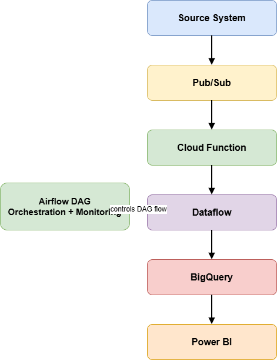

# 🚀 GCP Real-Time ETL Pipeline


## 📌 Overview
This project demonstrates a **real-time data pipeline** built using Google Cloud Platform (GCP) services to process high-volume streaming data efficiently and reliably.

---

## 🏗️ Architecture Diagram


---

## ❗ Problem Statement
Traditional batch processing systems caused delays in data availability, making it difficult for business teams to get real-time insights.

---

## 💡 Solution
Designed and implemented a **real-time ETL pipeline** using GCP services:

Source → Pub/Sub → Cloud Function → Dataflow → BigQuery → Power BI

- **Pub/Sub** for real-time data ingestion  
- **Cloud Functions** for event-driven processing  
- **Dataflow (Apache Beam)** for data transformation  
- **BigQuery** for scalable storage and analytics  
- **Airflow (Cloud Composer)** for orchestration and monitoring  

---

## ⚙️ Tech Stack
- **Programming:** Python  
- **Cloud Platform:** GCP (Pub/Sub, Dataflow, BigQuery, Cloud Functions)  
- **Orchestration:** Airflow (Cloud Composer)  
- **Data Quality:** pytest  
- **Visualization:** Power BI  

---

## 🔄 Pipeline Flow
1. Data is ingested in real-time using Pub/Sub  
2. Cloud Function triggers processing  
3. Dataflow performs transformation and cleaning  
4. Processed data is stored in BigQuery  
5. Dashboards are created using Power BI  
6. Airflow schedules and monitors the pipeline  

---

## 🧪 Data Quality Checks
- Null value validation  
- Email format validation  
- Range checks (e.g., age > 0)  
- Duplicate record handling  

---

## ✨ Key Features
- Real-time streaming pipeline  
- Scalable and fault-tolerant architecture  
- Automated orchestration using Airflow  
- Data validation using pytest  
- Optimized BigQuery performance using partitioning  

---

## 📈 Impact
- Reduced manual effort by **60%**  
- Improved processing performance by **40%**  
- Reduced BigQuery cost by **35%**  
- Enabled near real-time analytics  

---

## 📂 Project Structure
```
gcp-real-time-etl-pipeline/
│── dags/
│── dataflow/
│── cloud_function/
│── sql/
│── tests/
│── sample_data/
│── images/
│── README.md
```
