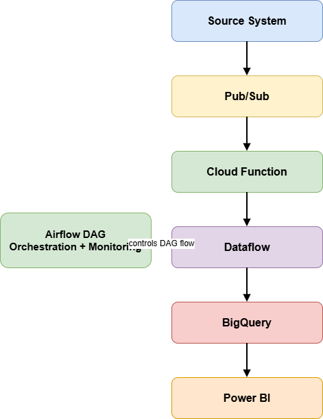

# 🚀 Qualimetry Data Analytics & GCP ETL Platform


---

## 📌 Overview
This project demonstrates a Qualimetry analytics platform that extracts data from enterprise engineering tools, processes it through GCP ETL services, and prepares analytics-ready datasets for BI dashboards.

---

## 🏗️ Architecture Diagram


---

## ❗ Problem Statement
Engineering, quality, and project delivery data is often spread across Jira, Confluence, SharePoint, and CodeBeamer, making it difficult to produce reliable portfolio metrics quickly.

---

## 💡 Solution
Designed Python-based REST API integrations with Pub/Sub, Cloud Functions, Dataflow/PySpark, BigQuery, Airflow orchestration, and data quality checks.

---

## 🔁 Architecture Flow
```
Jira / Confluence / SharePoint / CodeBeamer
        ↓
Python REST API Extraction
        ↓
Pub/Sub
        ↓
Cloud Function
        ↓
Dataflow / PySpark
        ↓
BigQuery
        ↓
Power BI / Spotfire
```

---

## ⚙️ Tech Stack
- **Programming:** Python
- **API Sources:** Jira, Confluence, SharePoint, CodeBeamer
- **Cloud Platform:** GCP (Pub/Sub, Dataflow, BigQuery, Cloud Functions)
- **Processing:** Dataflow / PySpark
- **Orchestration:** Airflow (Cloud Composer)
- **Data Quality:** pytest
- **Visualization:** Power BI, Spotfire

---

## 🔄 Pipeline Flow
1. Data is extracted from Jira, Confluence, SharePoint, and CodeBeamer using Python REST APIs.
2. API payloads are ingested through Pub/Sub and Cloud Functions.
3. Dataflow / PySpark performs transformation and cleaning.
4. Processed data is stored in BigQuery silver and gold tables.
5. Data quality checks validate issue-level records.
6. Power BI and Spotfire dashboards consume analytics-ready metrics.
7. Airflow schedules and monitors the pipeline.

---

## 🧪 Data Quality Checks
- Required issue ID validation
- Required issue key validation
- Status validation
- Analytics-readiness checks before BigQuery reporting

---

## ✨ Key Features
- Jira, Confluence, SharePoint, and CodeBeamer API extraction
- Real-time ingestion with Pub/Sub and Cloud Functions
- Scalable transformation layer with Dataflow / PySpark
- Automated orchestration using Airflow
- Data validation using pytest
- Optimized BigQuery metrics layer for dashboards

---

## 📈 Impact
- Reduced manual effort by **60%**
- Improved processing performance by **40%**
- Reduced BigQuery cost by **35%**
- Enabled near real-time analytics
- Achieved **99.9% pipeline reliability** through orchestration and monitoring

---

## 📂 Project Structure
```
gcp-real-time-etl-pipeline/
│── api_extractors/
│── cloud_function/
│── dags/
│── dataflow/
│── validation/
│── sql/
│── tests/
│── sample_data/
│── images/
│── docs/
│── README.md
```

---

## 🚀 How to Run (Local Simulation)
```bash
git clone https://github.com/Rajput14052/gcp-real-time-etl-pipeline.git
cd gcp-real-time-etl-pipeline
python dataflow/pipeline.py
pytest tests/
```

---

## Resume Project Line
Qualimetry Data Analytics & GCP ETL Platform: Built Python-based REST API integrations for Jira, Confluence, SharePoint, and CodeBeamer, processed data using GCP ETL pipelines, stored analytics-ready datasets in BigQuery, and supported Power BI/Spotfire dashboards with data quality checks and Airflow orchestration.

---

## 👨‍💻 Author
Rahul Kisan Rajput
